# mimic

Mimic takes a short screen recording of a single UI interaction (hover, click, dropdown, modal,
accordion, ...) or of a **continuously moving scroller** (an auto-scrolling marquee or carousel
that can be paused, dragged, flung and that resumes) and gives you a motion spec: what moved, by
how much, when, and with which easing or velocity profile, plus the measured sizes, positions
and colours. The numbers come from measuring the video's pixels with OpenCV, so they are
estimates, not the original CSS. Optional AI labeling names the elements. The result comes in
four formats: an **LLM prompt** you can paste into a coding agent, a technical spec, the JSON
spec (called the IR, Mimic's intermediate representation) and suggested CSS. Scrollers get a
fifth, a suggested **JS** driver. Access needs an account: an admin creates users, and each user
sees only their own jobs.

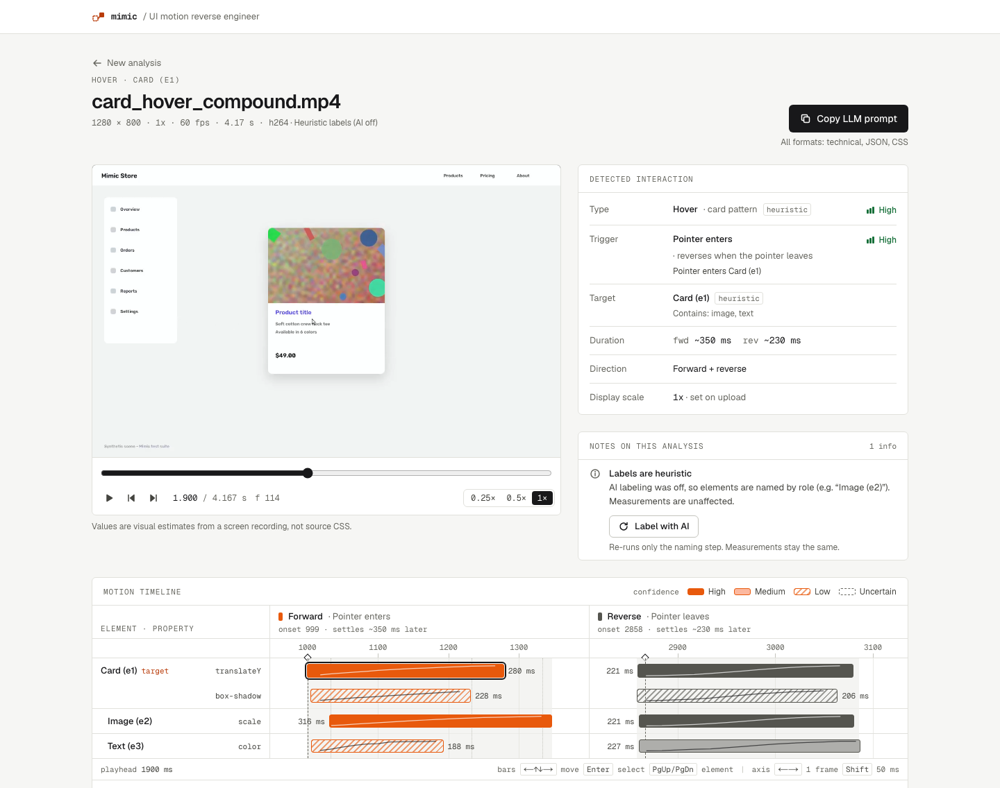

Contents: [Prerequisites](#prerequisites) · [Setup](#setup) · [Run](#run) ·
[Accounts](#first-admin-and-user-management) · [How to use](#how-to-use) ·
[AI labeling](#ai-labeling-optional) · [CLI](#cli-analysis-without-the-server) ·
[Tests & eval](#tests-and-synthetic-evaluation) · [Round trip](#round-trip-check) · [Make targets](#make-targets) · [HTTP API](#http-api) ·
[Debugging](#debugging-mimic_debug) · [Troubleshooting](#troubleshooting) ·
[Architecture](#architecture) · [Limitations](#known-limitations)

## Prerequisites

| Tool | Version | Why | Install (macOS) | Verify |
|---|---|---|---|---|
| [uv](https://docs.astral.sh/uv/) | recent (0.11 tested) | Python env + deps for `api/`. Installs **Python 3.13** itself (pinned in `api/.python-version`), so you don't need a separate Python install | `brew install uv` or `curl -LsSf https://astral.sh/uv/install.sh \| sh` | `uv --version` |
| [Node.js](https://nodejs.org/) | **≥ 22.13** (pnpm 11 needs it; Next.js 16 alone needs ≥ 20.9) | Frontend (`web/`) | `brew install node` (or nvm / asdf) | `node --version` |
| [pnpm](https://pnpm.io/) | **11.x** (`packageManager: pnpm@11.15.1`) | Frontend package manager | `brew install pnpm`, `npm install -g pnpm@11` or `curl -fsSL https://get.pnpm.io/install.sh \| sh -` | `pnpm --version` |
| [FFmpeg](https://ffmpeg.org/) (`ffmpeg` + `ffprobe`) | any recent (8.1 tested) | Probing, decoding and the preview video | `brew install ffmpeg` | `ffmpeg -version`, `ffprobe -version` |
| [Claude Code](https://docs.claude.com/en/docs/claude-code/overview) CLI | optional | Default AI labeling backend (`MIMIC_INTERPRETER=claude_cli`), uses your Claude login | `curl -fsSL https://claude.ai/install.sh \| bash` or `npm install -g @anthropic-ai/claude-code`, then run `claude` once to sign in | `claude --version` |
| OpenAI-compatible gateway (e.g. 9Router) | optional | Alternative AI labeling backend (`openai_compat`); the model must accept images | see the gateway's docs | "Test connection" in the UI |

**Linux:** use the official installers above for uv, pnpm and Claude Code. Install Node.js 22+
with nvm or your distro's NodeSource packages, and FFmpeg with your package manager
(`sudo apt install ffmpeg`, `sudo dnf install ffmpeg`). Everything else works the same.

`make check-tools` checks that `uv`, `pnpm`, `ffmpeg` and `ffprobe` are on `PATH`. If `claude`
is missing it prints a note, because AI labeling is optional.

## Setup

```bash
git clone https://github.com/kalfian/mimic.git
cd mimic
make setup                                  # check-tools → uv sync (api/) → pnpm install (web/) → data/jobs/
cp .env.example .env                        # backend settings (optional, all values have defaults)
cp web/.env.local.example web/.env.local    # frontend settings (optional, defaults shown below)
make create-admin                           # first admin account (prompts for username + password)
```

`make setup` ends by printing the OpenCV and NumPy versions. If that line appears, the backend
is ready.

**Backend `.env`** (repo root, gitignored, read by `api/app/config.py`, prefix `MIMIC_`):

| Variable | Default | What it does |
|---|---|---|
| `MIMIC_DATA_DIR` | `data` | Where the job DB (`mimic.db`) and `jobs/<id>/` (upload, preview, keyframes, results) go |
| `MIMIC_MAX_UPLOAD_MB` / `MIMIC_MAX_DURATION_S` / `MIMIC_MIN_DURATION_S` | `200` / `15.0` / `0.5` | Upload limits (the UI reads them from `/api/health`) |
| `MIMIC_INTERPRETER` | `claude_cli` | AI labeling backend: `claude_cli`, `openai_compat` or `none` (see [AI labeling](#ai-labeling-optional)) |
| `MIMIC_CLAUDE_MODEL` | `sonnet` | Model alias passed to `claude --model` |
| `MIMIC_LLM_BASE_URL` / `MIMIC_LLM_API_KEY` / `MIMIC_LLM_MODEL` | unset | Only for `openai_compat` |
| `MIMIC_CORS_ORIGINS` | `http://localhost:3000` | Comma-separated browser origins allowed to call the API. Explicit origins only: `*` is rejected at startup because requests carry the session cookie |
| `MIMIC_SESSION_IDLE_MINUTES` | `720` (12 h) | A session ends after this long without a request |
| `MIMIC_SESSION_ABSOLUTE_HOURS` | `168` (7 days) | A session ends this long after sign-in, active or not |
| `MIMIC_COOKIE_SECURE` | `0` | `1` adds `Secure` to the session cookie. Set it when the app is served over HTTPS |
| `MIMIC_FFMPEG_BIN` / `MIMIC_FFPROBE_BIN` | `ffmpeg` / `ffprobe` | Set these if FFmpeg is not on `PATH` |
| `MIMIC_DEBUG` | `0` | `1` writes per-job debug dumps (see [Debugging](#debugging-mimic_debug)) |

**Frontend `web/.env.local`** (Next.js only reads env files from `web/`):

| Variable | Default | What it does |
|---|---|---|
| `NEXT_PUBLIC_API_BASE_URL` | `http://localhost:8000` | The API base URL. The browser calls it directly. Use the **same hostname** as the address you open the app on (both `localhost`, not one `127.0.0.1`), or sign-in won't work (see [Troubleshooting](#troubleshooting)) |
| `NEXT_PUBLIC_API_MOCK` | `0` | `1` runs the UI against a fake in-browser API and a fixture result, so you don't need a backend |

Secrets such as `MIMIC_LLM_API_KEY` go only in your local `.env`. Never put them in the
`*.example` files. `NEXT_PUBLIC_*` values are built into the frontend bundle, so restart
`pnpm dev` after you change them.

## Run

Use two terminals:

```bash
make dev-api      # FastAPI on http://localhost:8000 (uvicorn --reload)
make dev-web      # Next.js on http://localhost:3000
```

Then open **http://localhost:3000** and sign in with the admin account from `make create-admin`
(next section). `http://localhost:8000/api/health` should report `"ffmpeg": true`. Without a
session it reports `"interpreter": null` and `"limits": null`, which is expected.

On its first start after an upgrade from a version without accounts, the API migrates
`data/mimic.db` and first writes a backup next to it (`mimic.db.pre-auth-<UTC time>.bak`).

`make dev-api` restarts on every file edit under `api/`. A restart interrupts any running job,
and that job ends as `failed` / `interrupted`. When you are only using the app, run the API
without reload:

```bash
cd api && uv run uvicorn app.main:app --port 8000
```

**Frontend-only work:** set `NEXT_PUBLIC_API_MOCK=1` in `web/.env.local` and run only
`make dev-web`. You get a "Mock API" badge, a simulated job lifecycle and the fixture result. You
can also go straight to the fixture result at
`/jobs/3f2b9c1d8e7a4b6c9d0e1f2a3b4c5d6e`. The scenario query params (`?fail=…`,
`?scenario=…`, `?interpreter=…`) are listed in [`web/lib/README.md`](web/lib/README.md#mock-mode).
Mock mode has fake accounts (`admin`, `user`, `alice`, `newbie` with a forced password change,
`disabled`): any non-empty password signs in, except the literal `wrong`. That is a stand-in for UI
work, not security.

## First admin and user management

There is no sign-up and there are no default credentials. Until the first admin exists, the
login page shows setup instructions instead of a form, and the API answers sign-ins with
`setup_required`.

**Create the first admin** on the API host:

```bash
make create-admin                              # prompts for the username, then the password twice
make create-admin USER=admin                   # username given, password prompted
make create-admin USER=admin PASSWORD_STDIN=1 < pw.txt   # scripts: one line from stdin
```

Passwords are prompted for or read from stdin, never passed as arguments. They need 12–256
characters and must not equal the username. Usernames are 3–32 characters: lowercase letters,
digits, `.`, `_`, `-`. The first admin takes over every job that existed before accounts
("Assigned N existing jobs to admin."). Running `create-admin` again later creates another admin
and reassigns nothing.

**Sign in.** Open the app and sign in. The header then shows the signed-in user and, for admins,
the **Users** page.

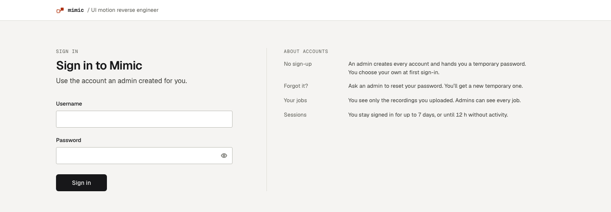

**Create users** on **Users → Create user** (username and role). Mimic generates a temporary
password and shows it **once**. Give it to the person over a private channel.

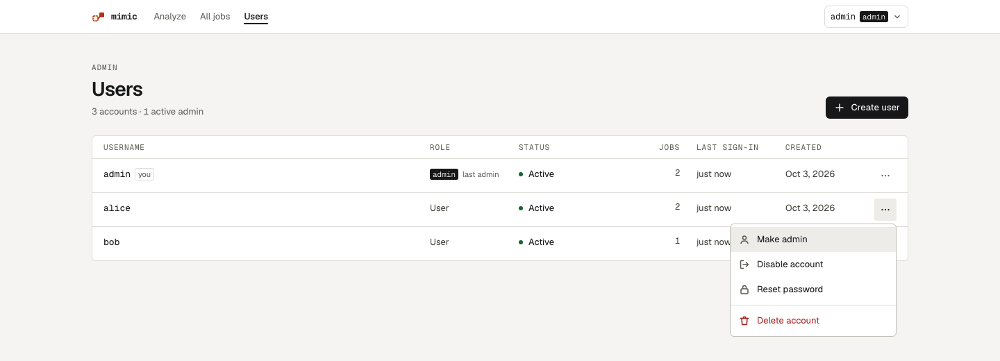

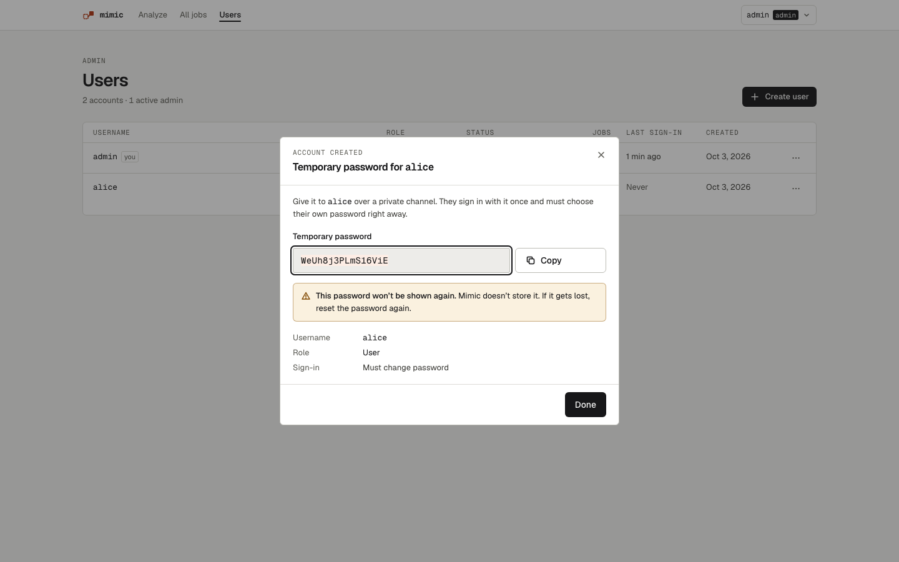

At the first sign-in with a temporary password, the user has to choose their own password before
they can do anything else. Changing a password signs out every other browser of that account.
Anyone can change their own password later from the user menu (**Change password**,
`/account/password`).

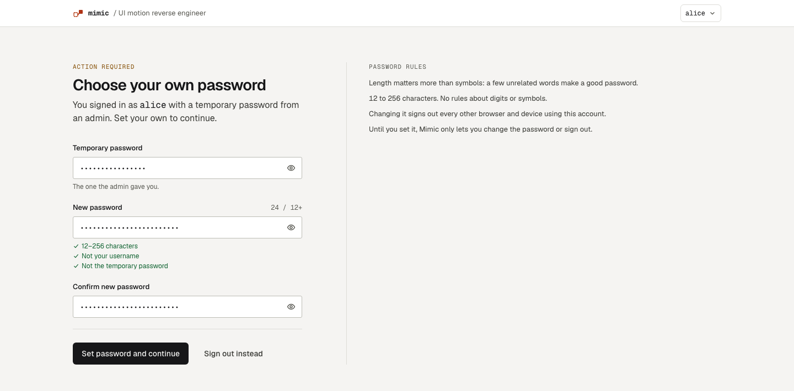

The row menu on **Users** has: make admin / make regular user, disable / enable, reset password
(a new temporary password, again shown once), and delete. Disabling, resetting or changing the
role signs the account out at once: their next request gets 401 and they land on the login page.
Deleting an account also deletes all of its jobs and files, including a job that is still
running. Admins can't disable, reset or delete their own account, and the **last active admin**
can't be demoted, disabled or deleted. The UI greys those actions out with the reason, and the
API refuses them (`self_action_forbidden`, `last_admin`).

**From the command line** (on the API host, same data dir as the API):

```bash
make list-users                                # username, role, active, must-change, job count
make reset-password USER=alice                 # break-glass: prompts for a new password
make reset-password USER=admin PASSWORD_STDIN=1 < pw.txt
make clean-jobs                                # delete every job (rows + files), keep accounts
make reset-data                                # wipe everything, accounts included
```

`reset-password` is for a forgotten admin password: it sets the password you type (no forced
change), re-enables the account and signs out all of its sessions. `clean-jobs` keeps users and
sessions. `reset-data` deletes the job DB (with every account) and `data/jobs/`, so run
`make create-admin` again afterwards. Both honour an exported `MIMIC_DATA_DIR`; `reset-data`
doesn't read `.env`, so export the variable if you only set it there.

### Roles and permissions

| Action | User | Admin |
|---|---|---|
| Upload and analyze | yes, owns the job | yes, owns the job |
| See jobs (list, result, video, keyframes) | own jobs only | every job, filter by owner |
| Re-run AI labeling on a job | own jobs | every job |
| Delete a job | own jobs | every job |
| AI labeling opt-in per upload | yes | yes |
| **Test connection** (`POST /api/interpreter/check`) | no (button hidden, API 403) | yes |
| Manage users (Users page, `/api/admin/users`) | no (403) | yes |
| Change own password | yes | yes |

Someone else's job answers **404**, as if it didn't exist. Jobs left without an owner (only
possible from before accounts) are visible to admins only and show as **Legacy**.

### Sessions and security

- **Session:** an opaque random token in the `mimic_session` cookie (`HttpOnly`,
  `SameSite=Lax`, host-only, `Secure` with `MIMIC_COOKIE_SECURE=1`). The server stores only its
  SHA-256 hash. It ends after 12 h without activity or 7 days after sign-in
  (`MIMIC_SESSION_IDLE_MINUTES`, `MIMIC_SESSION_ABSOLUTE_HOURS`), on sign-out, and whenever an
  admin disables the account, resets its password or changes its role.
- **Passwords** are hashed with scrypt (stdlib, per-password salt). Temporary passwords are
  generated by the server, shown once and never stored in plain text. No password, token or
  temporary password is logged; audit lines name user ids only.
- **Sign-in lockout:** 5 failed attempts for one username from one IP within 15 minutes, or 30
  from one IP, pause sign-in for that key with `429 too_many_attempts` and a `Retry-After`
  header. The login page counts down. The counter lives in memory, so an API restart clears it.
- **Cross-site requests:** state-changing requests (`POST`, `PATCH`, `DELETE`) with an `Origin`
  that isn't in `MIMIC_CORS_ORIGINS` (or the API's own origin) get `403 origin_not_allowed`.
  CORS uses credentials with an explicit origin list; `*` is refused.
- Accounts hold a username and a role, nothing else (no email or name).
- The cookie is scoped to the hostname, not the port, so other local servers on `localhost`
  also receive it. That is fine for a local tool. To serve Mimic beyond localhost, put the web app
  and the API on one site over HTTPS and set `MIMIC_COOKIE_SECURE=1`.

Design and decisions: [`docs/PLAN-auth.md`](docs/PLAN-auth.md).

## How to use

### 1. Record a good clip

How well the analysis works depends mostly on the recording. On the upload page, the right-hand
panel shows the same checklist:

1. Keep it short: **2–15 s** (the hard limits are 0.5–15 s and 200 MB). Formats: MP4, MOV, M4V, WebM.
2. Record at **60 fps** if you can, with the browser at **100 % zoom**. Keep the cursor visible.
3. Start recording, **wait about 1 s** without touching anything, then perform **one** interaction.
4. Wait until the animation has finished. For hovers, move the pointer away and let the reverse
   animation finish too: wait → enter → animate → hold → leave → reverse → wait.
5. Record one component. Don't scroll or change pages during the recording.

On macOS, use **Cmd + Shift + 5** → "Record Selected Portion" (or QuickTime Player → File → New
Screen Recording). Under Options, turn on "Show Mouse Clicks", and trim the clip in QuickTime
(Cmd + T) if it runs longer than 15 s. A Retina capture gives a large video, for example
2880 × 1800. Upload it as **2x** (see below).

#### Supported motion

- **Transitions** (state A → state B, optionally back): hover, press, click/toggle, dropdown,
  modal, accordion, staggered lists. Mimic needs a still start: the page rests, then one
  interaction happens.
- **Continuous scrollers** (one horizontal or vertical strip that moves from the very first
  frame). Mimic detects this automatically (there is no option to set) and measures:
  - **autoplay** speed and direction, and the loop length when the content repeats;
  - **pause** on press or hover, abrupt or with a slowdown;
  - **drag** along the axis, with its speeds; the outputs make the content follow the pointer
    1:1 (see [limitations](#known-limitations));
  - **momentum** after a fling: an exponential decay with time constant τ that either comes to
    rest or blends back into the autoplay speed (or an eased glide). Letting go without a fling
    (pointer already still) is told apart from momentum;
  - **snap** to the card grid;
  - **resume**: the delay after the motion comes to rest and the ramp back to autoplay speed;
  - **position-dependent card scaling**: cards that grow with their distance from the scroller
    centre (scale 1 at the centre, quadratic towards the edges) while keeping their gaps;
  - card size, gap and pitch, and the scroller's position and colours.

  The result shows a velocity chart with the phases instead of the transition timeline, and the
  outputs gain a **JS** tab with a requestAnimationFrame driver.
- **Ambient motion masking.** If something keeps moving from the first frame (a marquee, a
  looping animation) next to the component you interact with, Mimic masks that region and
  analyses the transition on its own (note `ambient_motion_masked`).
- Not supported: page scrolling, two-axis panning, rotating / 3D carousels, more than one
  analysed scroller, spring parameters (only an "overshoot" flag), element animations inside a
  moving scroller. Content moving from the first frame that is not a single-axis scroller is
  reported as `continuous_motion_unsupported`.

**Recording tips for carousels and marquees.**

1. **Show the pointer.** Keep the cursor visible and turn on **"Show Mouse Clicks"** (macOS).
   Without it Mimic still measures the motion, but has to infer the triggers (hover vs press).
2. Record at **60 fps**, with the whole scroller on screen. Don't scroll the page.
3. Start with a **lead of plain autoplay**: let it run for at least 1–2 s before you touch the
   scroller. The autoplay speed and the scroller's layout are measured from that lead.
4. Include **at least one drag**: grab, drag, and let go with a flick so the momentum shows.
   Let it come to rest.
5. Record the **resume**: keep the pointer off the scroller until autoplay is back at full speed
   for a second or two. The whole clip still has to fit in 15 s.

### 2. Upload and choose options

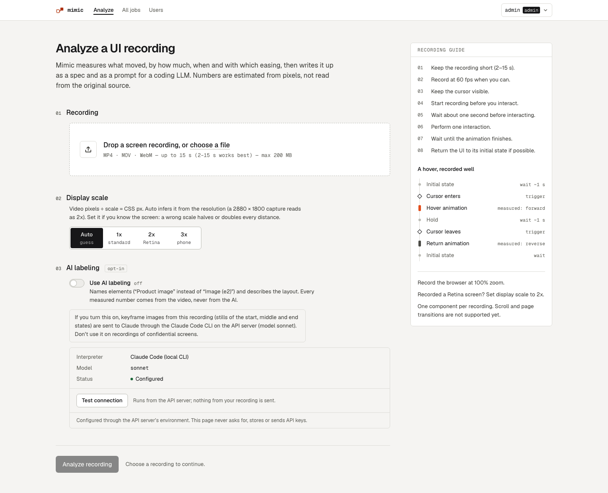

Drop the file or click "choose a file". The page reads the duration in the browser and checks it
against the server's limits before uploading.

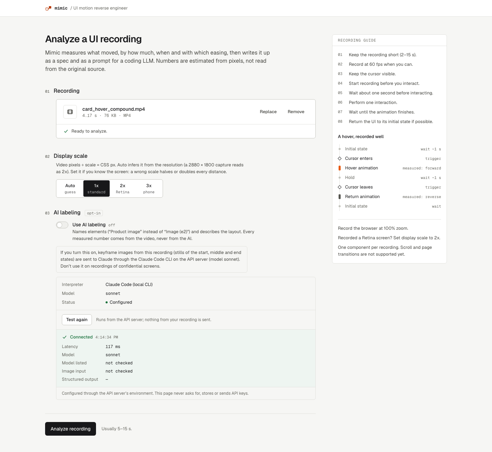

- **Display scale.** Video pixels ÷ scale = CSS px. **Auto** guesses 2x for large captures
  (≥ 2560 px wide or ≥ 1600 px tall). If you know the screen, choose `1x` / `2x` (Retina) / `3x`
  (phone). A wrong scale halves or doubles every distance.
- **AI labeling (opt-in, off by default).** When it is on, a few keyframe stills (start, middle
  and end states) go to the configured interpreter so it can name elements ("Product image"
  instead of "Image (e2)"). **Don't turn it on for confidential screens.** With it off, nothing
  from the recording leaves the API server. Every number is measured from the video either way.
  The AI never changes a measured value.

Click **Analyze recording**. It usually takes 5–15 s. AI labeling can add up to about 2 minutes.

### 3. Processing

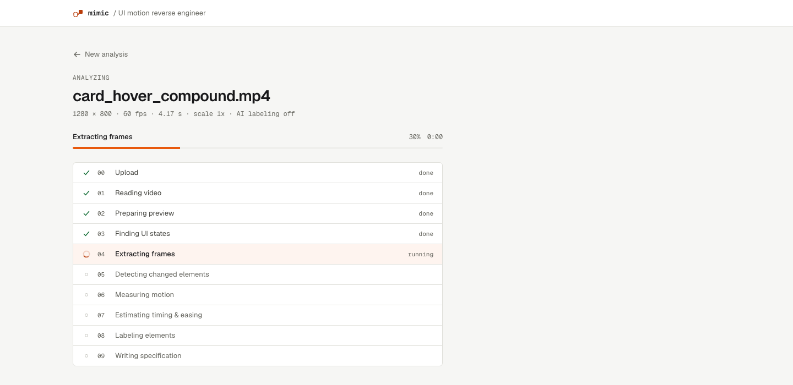

The job page lists the pipeline stages with their live status. You can reload it or come back
later with the same URL (`/jobs/<id>`), or find it under **My jobs** (see
[step 7](#7-find-and-delete-jobs)). If the analysis fails, the page explains what went wrong
and what to try next (see [Troubleshooting](#troubleshooting)).

### 4. Read the result

The top of the result page (hero image above) has:

- **Video player** with frame stepping, a scrubber and 0.25× / 0.5× / 1× speed. It stays in sync
  with the timeline playhead.
- **Detected interaction:** type (hover, click, open/close, ...), trigger, target element,
  forward/reverse durations, direction and display scale. Each item has a confidence badge.
- **Notes on this analysis:** warnings that tell you how far to trust the result, for example
  VFR video, a missing reverse, `frames_subsampled` or heuristic labels.

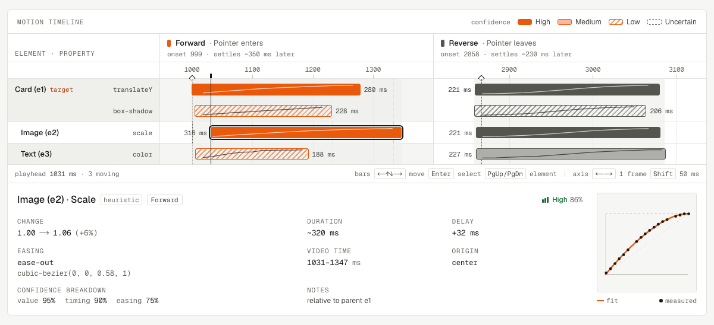

**Motion timeline.** There is one row per element property and one column per motion (forward /
reverse). Each bar shows when a transition starts and how long it takes, with its easing curve
drawn inside. Click a bar, or move with the keyboard, to open the inspector below it. The
inspector shows from → to values, duration, delay, easing (the family plus a
`cubic-bezier(...)`), origin, the fitted curve against the measured points, and a confidence
breakdown (value / timing / easing).

- Keyboard: arrow keys move between bars, **Enter** / **Space** selects one, **PgUp/PgDn** jump
  between elements, and **Home/End** go to the first/last column. On the time axes, ←/→ moves the
  playhead by one frame and Shift + arrow moves it 50 ms.
- Confidence: **High** ≥ 0.8, **Medium** ≥ 0.5, **Low** < 0.5 (hatched). Changes below 0.3 are
  **uncertain** (dashed outline). They are shown by default, and a checkbox hides them.

Under the timeline are the **keyframes** (A · start, 25 / 50 / 75 %, B · end, with optional
element boxes) and before/after crops of each changed element.

#### Continuous scrollers

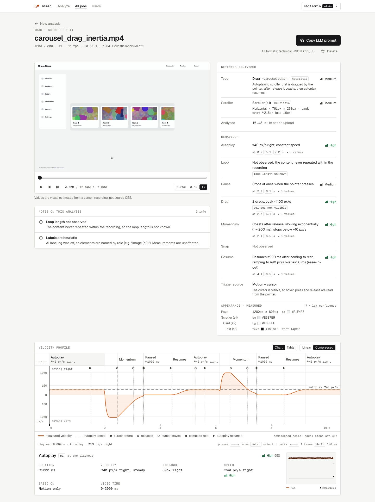

For a scroller the result page looks different (the screenshots use the synthetic C4 carousel
`carousel_drag_inertia.mp4` from `make synth`):

- **Detected behaviour** lists the pattern (marquee, carousel), the scroller with its size and
  card spacing, then one row per behaviour: autoplay, loop, pause, drag, momentum, snap, resume
  and the trigger source (motion + cursor, or motion only). Each row has its confidence and
  the times where it happened; clicking a time moves the video there. **Appearance · measured**
  below it lists the page, scroller, card and text colours, sizes and an approximate font size
  (`?` marks low confidence).
- **Velocity profile:** the measured speed over time (right/down above zero, left/up below), the
  autoplay speed as a dashed line, and markers for pointer enter / leave, release, rest and
  resume. **Compressed** (default) is a log scale (equal steps are ×10) so a slow autoplay and a
  fast drag both stay readable; **Linear** shows true proportions; **Table** lists the same
  phases with their values.
- The **phase strip** above the chart works like the timeline: click a phase, or use ← / → and
  **Enter**, to select it and move the video to its start. The inspector shows its duration,
  velocities, distance, the fitted model (constant speed, exponential decay with τ, ease of a
  ramp) drawn against the measured points, and its confidence.

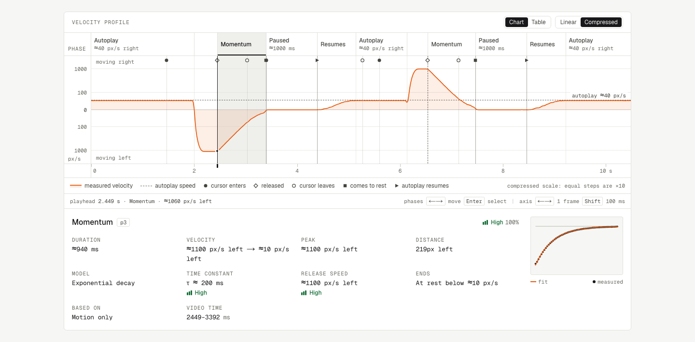

### 5. Copy the output

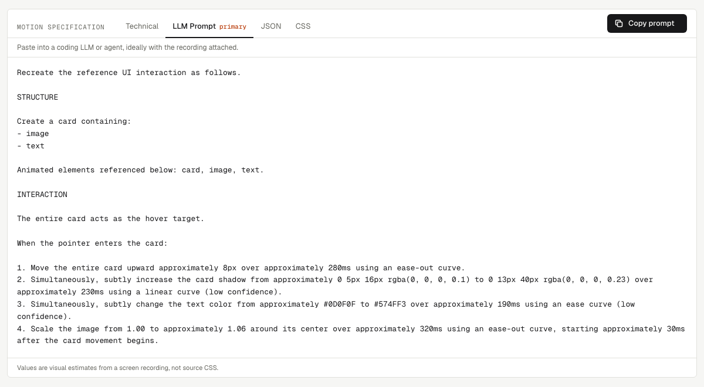

**Copy LLM prompt** (top right) or the **Motion specification** tabs give you:

| Tab | Use it for |
|---|---|
| **LLM Prompt** (default) | Paste into a coding LLM or agent, ideally with the recording attached |
| Technical | A readable spec for a developer |
| JSON | The motion IR (schema 0.1, no per-frame samples) |
| CSS | A suggested implementation. The original site may have used other CSS, JS or an animation library |
| JS (scrollers only) | A suggested requestAnimationFrame driver for the scroller: autoplay, pause, drag with pointer capture, momentum, snap, resume ramp and card scaling, with every measured value as a named constant. The site may have used a carousel library instead |

The LLM prompt asks for **one self-contained, responsive `index.html`** (HTML, a `<style>` block,
inline script only if needed; no frameworks, CDNs or external assets). It builds the detected
structure with neutral placeholders (gradient blocks for images, role-named text), not the
recording's real images or copy. The layout reflows from 320 px phones to wide desktops, while
the measured motion values stay as given in px and ms. It also asks for hover styles behind
`@media (hover: hover)` with focus and tap fallbacks (click and press use a real `<button>`)
and a `prefers-reduced-motion` variant.

**APPEARANCE block.** After STRUCTURE, the prompt has an **APPEARANCE (measured, approximate)**
block: the recorded viewport and page background, each element's size and position (for a
scroller: its top-left corner in the recorded viewport, card size, gap, card and scroller
backgrounds), text colour, radius, shadow and an approximate font size. Each value is hedged by
its confidence. The builder is asked to match these at the recorded viewport size; content stays
placeholder. Fonts, real images and text can't be recovered, so expect "visually close", not
pixel-identical.

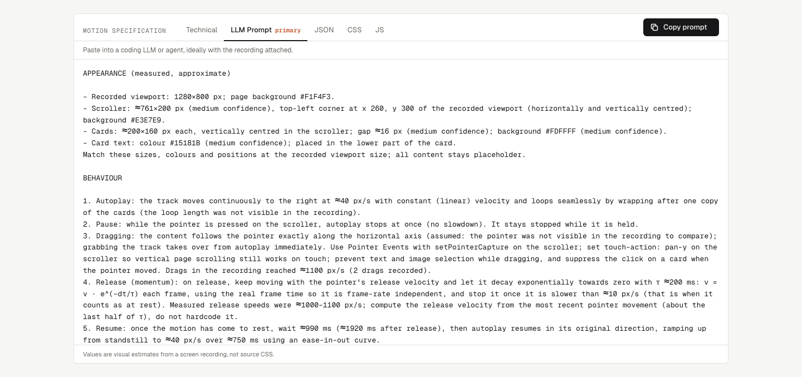

For scrollers, the prompt's BEHAVIOUR section describes each measured behaviour as a rule with its
numbers (autoplay, pause trigger, drag, release and momentum law, snap, resume, card scaling),
and the **JS** tab gives the same behaviour as code:

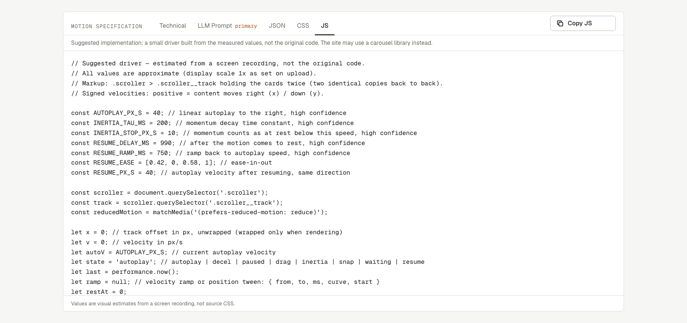

### 6. Add AI labels afterwards

If the job ran with labeling off, the "Labels are heuristic" note has a **Label with AI**
button. It re-runs only the naming step, using the stored measurements
(`POST /api/jobs/{id}/interpret`). The video is not decoded again and no measured numbers
change. The prompt, JSON and CSS are regenerated. This button is the explicit opt-in: clicking it
sends the keyframes to the interpreter. If the re-run fails, the previous result stays.

Dark theme follows the OS (`prefers-color-scheme`):

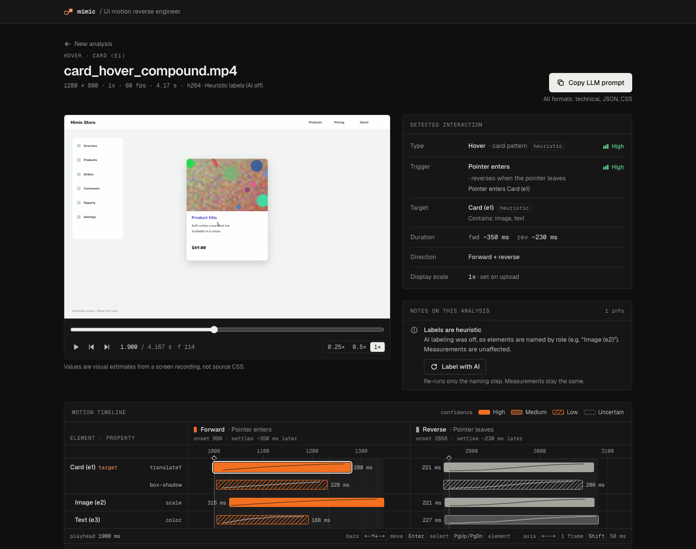

### 7. Find and delete jobs

**My jobs** (`/jobs`) lists your analyses, newest first, with status, duration and whether AI
labeling was on. Running jobs update by themselves. The trash button (also **Delete** on a job
page) removes the recording, its result and keyframes for good, even while the job is running.

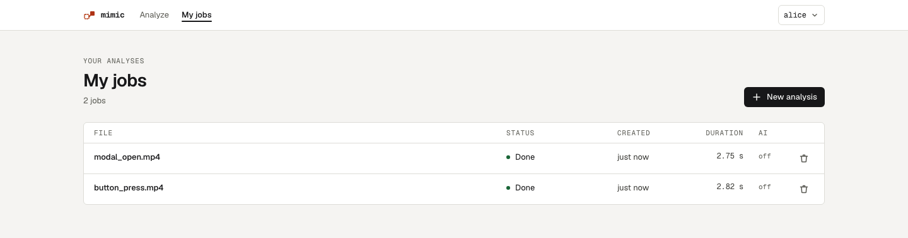

Admins see **All jobs** with an **Owner** column and an owner filter (Everyone, Me, or one
account). A job from before accounts that nobody owns shows as **Legacy**.

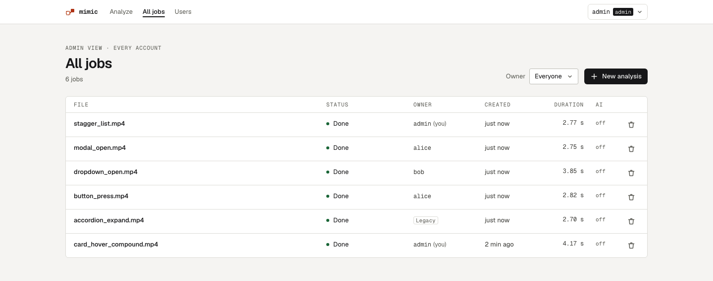

## AI labeling (optional)

The backend is configured on the server only, in `.env`. The browser never sees keys or tokens.

| `MIMIC_INTERPRETER` | What runs when a job opts in | Settings |
|---|---|---|
| `claude_cli` (default) | A `claude -p` subprocess that uses the Claude Code login under `$HOME` (no API key) | `MIMIC_CLAUDE_BIN` (`claude`), `MIMIC_CLAUDE_MODEL` (`sonnet`), `MIMIC_CLAUDE_TIMEOUT_S` (`120`) |
| `openai_compat` | Any OpenAI-compatible gateway (`POST {base}/chat/completions`). Keyframes are sent as images, so use a vision model | `MIMIC_LLM_BASE_URL`, `MIMIC_LLM_API_KEY`, `MIMIC_LLM_MODEL`, `MIMIC_LLM_TIMEOUT_S` (`120`), `MIMIC_LLM_SUPPORTS_JSON_SCHEMA` (`auto`) |
| `none` | Nothing. Elements get heuristic labels only | none |

- **claude_cli:** install Claude Code, run `claude` once on the API host to sign in, and keep
  the default `.env`.
- **openai_compat**, for example with a local 9Router (the values are placeholders):

  ```bash
  MIMIC_INTERPRETER=openai_compat
  MIMIC_LLM_BASE_URL=http://localhost:20128/v1
  MIMIC_LLM_API_KEY=<your-gateway-token>
  MIMIC_LLM_MODEL=<model-id-that-accepts-images>
  ```

Restart the API after you change `.env`.

**Check the connection.** The upload page shows the interpreter mode, model and status to
everyone who is signed in. Admins also get **Test connection**, which runs
`POST /api/interpreter/check` from the API server (regular users get 403):

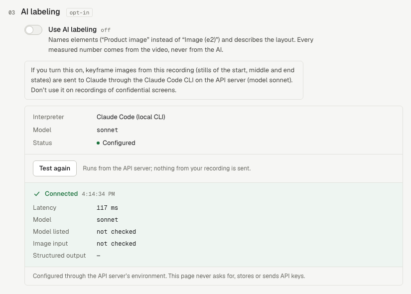

The API needs a session cookie, so sign in first. This reads the password without echoing it
and keeps it out of your shell history and the process list (passwords that contain `"` or `\`
need JSON escaping):

```bash
read -rs -p 'Password: ' PW; echo
printf '{"username":"admin","password":"%s"}' "$PW" \
  | curl -s -c mimic.cookies -H 'Content-Type: application/json' --data-binary @- \
      http://localhost:8000/api/auth/login
unset PW
curl -s -b mimic.cookies -X POST http://localhost:8000/api/interpreter/check
# {"mode":"claude_cli","ok":true,"latency_ms":86,"model":"sonnet",...,"error":null,...}
curl -s -b mimic.cookies -X POST http://localhost:8000/api/auth/logout && rm mimic.cookies
```

`mimic.cookies` holds a live session token until you sign out, so delete it afterwards.

- `openai_compat`: calls `GET {base}/models`, then sends one tiny chat completion with a
  generated test image (never your data). It reports whether the model is listed, whether it
  accepts images and which structured-output mode works.
- `claude_cli`: checks only that the binary exists and that `claude --version` runs. It does
  **not** prove that you are signed in. If you aren't, labeling jobs fall back to heuristic
  labels and the result says so.
- Failure codes include `not_configured`, `unauthorized`, `unreachable`, `timeout`,
  `model_not_found`, `no_image_support` and `bad_response`. The UI shows what to fix for each one.

`GET /api/health` reports whether the mode is configured, without calling it. An interpreter
failure (timeout, error, bad output) never fails a job: the job falls back to heuristic labels
and adds a warning. Tokens are never logged, sent to the browser or written to job files.

## CLI analysis (without the server)

```bash
cd api
uv run python scripts/analyze.py rec.mov --pixel-ratio 2               # summary + stage timings
uv run python scripts/analyze.py rec.mp4 --print llm_prompt            # one output: technical|llm_prompt|css|js|json|ir
uv run python scripts/analyze.py rec.mov --no-keyframes               # numbers only: no frame images written (continuous: phase table)
uv run python scripts/analyze.py rec.mp4 --out result.json --keyframes kf/ --debug dbg/
uv run python scripts/analyze.py rec.mp4 --use-interpreter             # AI labels (needs MIMIC_INTERPRETER)
```

If the recording can't be analysed, the script prints the API error
(e.g. `error: no_motion_detected: …`) and exits with code 3.
`uv run python -m app.pipeline.debug VIDEO` runs only the measurement stages.

## Tests and synthetic evaluation

```bash
make test         # api: pytest (synth + claude_live markers excluded) · web: typecheck + lint + unit tests
make synth        # render 32 synthetic scenario videos + ground truth into data/synth (~2 min)
make eval         # run the pipeline on data/synth, write <name>.ir.json, check PLAN §11.4 / continuous §8.4 targets
make calibrate    # Monte Carlo check that confidence bands are earned (high ≥ 90 % within target), transitions + scrollers
cd api && uv run pytest -m synth   # the same accuracy assertions as pytest
```

The synthetic suite covers card hover (with 30 fps / VFR / crf 28 / Retina / MOV / WebM /
no-cursor variants), button colour and press, dropdown, modal, accordion, stagger, and scroll and
static negatives (17 transition scenarios), plus 15 continuous ones (PLAN-continuous §8.2):
marquees (looping, hover pause, vertical ticker), carousels with drag + momentum (no cursor,
30 fps, VFR, a 75 Hz recorder clock like macOS captures), snap, a fast fling at crf 28, a hover
card next to a marquee (masked), flat placeholder cards with a drag that stops while pressed and
an unsupported ambient animation. `make eval` prints `SUITE: PASS` only if every threshold holds: values,
start/duration, easing family ≥ 80 %, interaction type, relationships and confidence bands.

**Contract workflow.** `api/app/models/ir.py` and `api/app/api/schemas.py` are the source of
truth. After you change them, run `make contract`. Never edit `web/lib/types.ts` by hand. After
editing `docs/contract/sample-result.json`, run `pnpm -C web sync:fixture`.

## Round-trip check

Does an `index.html` built from Mimic's prompt behave like the recording? The round-trip harness
(PLAN-continuous §14) replays the recorded interaction on the page, records it, analyses that
replica video with the same pipeline and compares the two IRs.

```bash
cd api && uv run python scripts/analyze.py recording.mov --out /tmp/source.json --no-keyframes
make roundtrip HTML=/path/to/index.html IR=/tmp/source.json [OUT=/tmp/rt]   # prints a pass/fail table
make roundtrip                                                              # self-check on synthetic truth (~3 min)
```

- **Replay.** Viewport and pixel ratio come from the source IR. Continuous: the pointer waits
  outside the scroller, enters and presses on the same frame at each measured drag start, drags
  along the axis so the content covers the measured distance and is released at the measured
  release speed, then leaves; hover pauses are replayed as enter/leave. A drag that ends at rest
  (the pointer stopped before letting go) replays the content's own measured path, then stays
  pressed and still through a following rest (into the next drag as one press, or for 150 ms
  before letting go without velocity). Transition: hover / click / press on the measured target
  box at the measured trigger times.
- **Capture** (`tools/roundtrip/capture.mjs`, Node built-ins only): headless Chrome
  (Playwright's `chrome-headless-shell`, or `MIMIC_CHROME=/path/to/chrome`) on its own free
  DevTools port and a throw-away profile. Capture is deterministic: virtual time advances one
  frame (1/60 s) at a time, and `requestAnimationFrame`, CSS animations/transitions and event
  timestamps all follow that clock. `--capture screencast` is a real-time fallback.
- **Compare** (`scripts/compare_roundtrip.py SOURCE REPLICA`). Continuous: same phase sequence,
  autoplay ±5 % and same direction, inertia τ ±20 % and mode, resume delay and rest durations
  ±100 ms, resume ramp / pause slowdown by the time they take to reach 90 % of their speed change
  (±100 ms), snap presence, scroller/card/pitch/gap ±2 px, card scaling ±0.03 at the source's
  reference distance (scaling on one side only fails; card size and pitch are then not compared),
  colours ΔE ≤ 5. Transition: same
  segments, duration ±max(20 ms, 10 %), values per PLAN §11.4, same easing family. Anything
  the source didn't measure shows `n/a`, never `PASS`.
- Output (default `/tmp/mimic-roundtrip/…`): `plan.json`, `frames/`, `replica.mp4`,
  `replica.ir.json`, `compare.json`. Exit code 0 = PASS, 1 = FAIL.
- Text and images may differ from the recording; only layout, colours, motion and flow are
  compared. Element boxes and colours are measured from video on both sides, so they carry
  codec noise. The scroller box is about ±3 px depending on encoder quality, which is close to
  the ±2 px tolerance. Flat placeholder cards that also scale with their position track ≈3–4 %
  slow (the tracker follows the few, mostly central features), inside the ±5 % autoplay
  tolerance but worth knowing.

**Acceptance procedure** (how a recording is checked end to end):

1. Analyse the recording: `uv run python scripts/analyze.py recording.mov --out /tmp/source.json
   --no-keyframes`, and take its LLM prompt (`--print llm_prompt`, or **Copy LLM prompt** in the
   UI).
2. Give **only the prompt** to an independent coding LLM (no video, no keyframes, no IR) and let
   it write `index.html`. Don't hand-edit the result: if a row fails, fix Mimic (measurement or
   prompt) and rebuild the page from the new prompt.
3. `make roundtrip HTML=index.html IR=/tmp/source.json` and read the table.

**Result on a real recording** (an auto-scrolling carousel with drags, recorded on screen):
**PASS, 18/18 rows** on the third run. Same phase sequence; autoplay
35.3 vs 33.9 px/s; momentum τ 258 vs 260 ms, decaying towards the autoplay speed; resume delay
195 vs 197 ms and ramp 815 vs 841 ms; scroller 740×182 at (93, 307) vs 741×182 at (92, 307);
card 162.8×147.2 vs 162.7×146.8 px; pitch 167.8 vs 168 px; gap 5.1 vs 5.3 px; card scale ×1.169
vs ×1.170 at 261 px from the centre; colours ΔE 0.3 (source vs replica). The first two runs
failed (9/16, then 11/17): Mimic modelled every release as momentum blending into autoplay and
mis-measured the replica's geometry, then the prompt let the builder scale off-screen cards
without bound. Both were fixed in Mimic; details in
[`docs/PLAN-continuous.md`](docs/PLAN-continuous.md#acceptance-result).

## Make targets

| Target | What it does |
|---|---|
| `make help` | List targets |
| `make check-tools` | Check that uv, pnpm, ffmpeg, ffprobe are on `PATH` (and note if `claude` is missing) |
| `make setup` | `check-tools`, `uv sync` (api), `pnpm install` (web), create `data/jobs` |
| `make dev-api` / `make dev-web` | API on :8000 (with reload) / web on :3000 |
| `make test` (`test-api`, `test-web`) | Backend pytest + frontend typecheck, lint, unit tests |
| `make lint` | `ruff check` + `ruff format --check` + ESLint |
| `make contract` / `make contract-check` | Regenerate / verify `docs/contract/motion-spec.schema.json` + `web/lib/types.ts` |
| `make synth` / `make eval` / `make calibrate` | Synthetic videos / accuracy suite / confidence calibration |
| `make roundtrip [HTML=… IR=… OUT=…]` | Round-trip check of a replica page against a source IR; without arguments, the harness self-check on synthetic truth |
| `make create-admin` | Create an admin; the first one takes over existing jobs. `USER=<name>`, `PASSWORD_STDIN=1` |
| `make reset-password USER=<name>` | Break-glass password reset: sets a new password, re-enables the account, signs it out. `PASSWORD_STDIN=1` |
| `make list-users` | List accounts: username, role, active, must-change, job count |
| `make clean-jobs` | Delete all jobs (rows, uploads, artifacts, debug dumps). Accounts are kept |
| `make reset-data` | Delete everything: job DB **including accounts** and `data/jobs/`. Run `make create-admin` again |

## HTTP API

The browser calls these directly (`NEXT_PUBLIC_API_BASE_URL`). Errors are always
`{"error": {"code", "message"}}`. Interactive docs: http://localhost:8000/docs. "Session" means
the `mimic_session` cookie from `POST /api/auth/login`.

| Method & path | Who | What |
|---|---|---|
| `GET /api/health` | anyone | `status`, `version`, `ffmpeg`. `interpreter` and `limits` only with a session (else `null`) |
| `GET /api/auth/status` | anyone | `{"setup_required": bool}` (no admin yet) |
| `POST /api/auth/login` | anyone | `{username, password}` → the account + session cookie. `401 invalid_credentials`, `403 account_disabled`, `409 setup_required`, `429 too_many_attempts` |
| `POST /api/auth/logout` | anyone | Ends the session (204) |
| `GET /api/auth/me` | session | The signed-in account (`role`, `must_change_password`) |
| `POST /api/auth/password` | session | `{current_password, new_password}`; signs out other sessions, sets a new cookie |
| `POST /api/jobs` | user | Multipart upload (`file`, `pixel_ratio`, `use_interpreter`) → job id |
| `GET /api/jobs` | user | Job list, newest first. `?owner=me\|<user id>` (other accounts: admins only), `?status=`, `?limit=` (1–200), `?cursor=` |
| `GET /api/jobs/{id}` (`/result`, `/video`, `/keyframes/{name}`) | owner or admin | Status, result, preview video, keyframe images. Anyone else gets 404 |
| `POST /api/jobs/{id}/interpret` | owner or admin | Re-run AI labeling on a finished job |
| `DELETE /api/jobs/{id}` | owner or admin | Delete the job and its files (204), also while it runs |
| `POST /api/interpreter/check` | admin | Test the configured interpreter |
| `GET /api/admin/users`, `POST /api/admin/users` | admin | List accounts / create one (→ temporary password, shown once) |
| `PATCH /api/admin/users/{id}` | admin | `{role?, is_active?}`. `409 last_admin`, `409 self_action_forbidden` |
| `POST /api/admin/users/{id}/reset-password` | admin | New temporary password, forces a change at the next sign-in |
| `DELETE /api/admin/users/{id}` | admin | Delete the account with all its jobs and files |

"user" means any signed-in account whose password isn't waiting for a forced change; until it
is changed, only `/api/auth/*` and the public part of `/api/health` work (everything else answers
`403 password_change_required`). The full
contract (models, every error code) is in [`docs/PLAN-auth.md`](docs/PLAN-auth.md) §3 and the
generated [`web/lib/types.ts`](web/lib/types.ts).

## Debugging (`MIMIC_DEBUG`)

Set `MIMIC_DEBUG=1` in `.env` and restart the API. Every job then also writes
`data/jobs/<id>/debug/`:

| File | Contents |
|---|---|
| `energy.csv` | For each pass-1 frame (30 fps): time, UI change energy, changed fraction, global shift + response, cursor position/state |
| `segments.json` | Active/stable segments, the primary interaction, windows, crop rectangle, warnings |
| `elements.json` | Element candidates: CSS boxes in state A/B, kind, parent, A→B warp |
| `masks/state_a.png`, `state_b.png`, `change_mask.png` | Median state frames (cropped) and the change mask |
| `tracks/<element>_<segment>_<property>.csv` | Per-frame series (time, value, quality) |
| `summary.json` | Elements, every series' endpoints, classifier features, heuristic interaction, target |

The dumps contain crops of the recording. They stay in `data/` (the API never serves them), and
`make clean-jobs` deletes them. `scripts/analyze.py --debug DIR` writes the same dumps for a
single file.

## Troubleshooting

| Symptom | Cause / fix |
|---|---|
| `missing required tool: ffmpeg` from `make setup`, `"ffmpeg": false` in `/api/health`, or a job fails with "ffprobe is not installed or not on PATH" | Install FFmpeg (`brew install ffmpeg`) or set `MIMIC_FFMPEG_BIN` / `MIMIC_FFPROBE_BIN`, then restart the API |
| `address already in use` on :8000 / :3000 | Another process holds the port: `lsof -iTCP:8000 -sTCP:LISTEN`, then stop it, or run `uvicorn ... --port <n>` and set `NEXT_PUBLIC_API_BASE_URL` to match |
| "Server unreachable" on the upload page | Start the API, check `NEXT_PUBLIC_API_BASE_URL`, and make sure `MIMIC_CORS_ORIGINS` includes the web origin |
| Login page says **Setup required** / the API answers `setup_required` | No admin exists yet. Run `make create-admin` on the API host, then **Check again** |
| Sign-in "doesn't stick", **Sign-in didn't stick**, **Hostnames don't match**, or "Server unreachable" naming two hostnames | The app and the API are on different hostnames (e.g. `127.0.0.1:3000` and `localhost:8000`). The cookie is per hostname, and the API only accepts origins in `MIMIC_CORS_ORIGINS`. Open the app on the hostname in `NEXT_PUBLIC_API_BASE_URL` (default: **http://localhost:3000**) |
| `pnpm dev` opened on `http://127.0.0.1:3000` stays at "Checking your session…" | Next.js dev blocks its dev resources for other hostnames (log: "Blocked cross-origin request … from 127.0.0.1"), so the page never starts. Use `http://localhost:3000` |
| **Too many failed attempts** with a countdown | 5 wrong passwords for one username (or 30 from one IP) within 15 min. Wait for the countdown, or restart the API (the counter is in memory) |
| **Account disabled** | An admin disabled the account. Ask an admin to enable it (Users → Enable account) |
| Forgot the admin password / every admin locked out | On the API host: `make reset-password USER=<admin>`. It sets a new password, re-enables the account and signs out its sessions |
| Signed out while working ("Your session ended") | The session expired (12 h idle, 7 days max) or an admin disabled the account, reset its password or changed its role. Sign in again |
| API refuses to start: `MIMIC_CORS_ORIGINS must list explicit origins` | Replace `*` with the real web origin(s), e.g. `http://localhost:3000` |
| API refuses to start: `database schema vN is newer than this code` | The DB was migrated by a newer Mimic. Upgrade Mimic; downgrades aren't supported |
| `too_long` / `too_short` | The clip is outside 0.5–15 s. Trim it to just the interaction, with about 1 s of stillness before it |
| `no_motion_detected` | No UI change was found. Make sure the animation is on screen and finishes within the clip |
| `continuous_motion_unsupported` | Something moves from the first frame but not as one horizontal or vertical scroller (two-axis or rotating content, several strips moving against each other, untrackable motion). The message names the region. Record a component that rests before you interact, or pause that animation |
| `no_stable_state` | The UI was already moving when recording started. Wait about 1 s before interacting |
| `unsupported_motion` | The whole page moved (scroll / page transition). Record a single component without scrolling |
| `decode_failed` | Re-export the clip as an H.264 MP4 |
| `interrupted` | The API restarted mid-job (often `--reload`). Upload again, or run uvicorn without `--reload` |
| Interpreter `unauthorized` | `claude_cli`: run `claude` on the API host to sign in. `openai_compat`: check `MIMIC_LLM_API_KEY` |
| Interpreter `unreachable` / `timeout` | Check that `MIMIC_LLM_BASE_URL` is up and reachable from the API host, or raise `MIMIC_LLM_TIMEOUT_S` |
| Interpreter `model_not_found` / `no_image_support` | Set `MIMIC_LLM_MODEL` to a vision-capable model that the gateway lists |
| Every distance is 2× too big or small | Wrong display scale. Re-upload with the right `1x` / `2x` / `3x` |

## Architecture

```
recording ─► Layer A: measurement (FFmpeg + OpenCV, deterministic) ─► every number
              probe → preview (background) → scan (30 fps) → decode windows (native fps)
              → elements → per-frame tracking → timing/easing fit + confidence → keyframes
          ─► Layer B: interpretation (optional AI) ─► labels, roles, hierarchy, type check
          ─► assemble IR (MotionSpec) ─► Technical / LLM prompt / JSON / CSS (+ JS for scrollers; pure templates)
```

Scrollers branch after the scan: regions that move from the first frame are classified (single-axis
scroller, other ambient motion, page scroll). A scroller with interaction phases is measured as a
displacement time series, segmented into phases (autoplay, decelerate, paused, drag, inertia,
snap, stop, resume) with fitted kinematics; anything else ambient is masked out of the transition path.
Details: [`docs/PLAN-continuous.md`](docs/PLAN-continuous.md).

- **Layer A owns the numbers.** The interpreter's output schema has no numeric fields except its
  own confidence, so it can't change a measured value.
- **The IR is the source of truth.** All outputs are deterministic functions of it.
- Geometry is in CSS px: device pixels divided by the display scale.
- Jobs run in-process with one worker. Job state is in SQLite and files are under
  `data/jobs/<id>/`.
- Accounts and sessions live in the same SQLite file (schema versioned with
  `PRAGMA user_version`, migrated at startup). Every job has an owner, enforced in the API; the
  web app's route guard is only for navigation. Details: [`docs/PLAN-auth.md`](docs/PLAN-auth.md).

```
api/    FastAPI backend + measurement pipeline (uv, Python 3.13)
web/    Next.js 16 frontend (App Router, TypeScript, Tailwind, pnpm)
docs/   PLAN.md (plan + phase notes), PLAN-auth.md (accounts), PLAN-continuous.md (scrollers), contract/ (API + IR schema, shared fixture), screenshots/
data/   runtime data: jobs, job DB, synthetic videos (gitignored)
```

More detail: [`PRD.md`](PRD.md) (product), [`docs/PLAN.md`](docs/PLAN.md) (architecture,
algorithms, phase notes), [`docs/PLAN-auth.md`](docs/PLAN-auth.md) (accounts, sessions, authz),
[`docs/PLAN-continuous.md`](docs/PLAN-continuous.md) (scrollers, round trip, acceptance), [`docs/contract/`](docs/contract/) (JSON schema + sample result),
[`web/lib/README.md`](web/lib/README.md) (frontend data layer, mock mode).

## Known limitations

- **Display scale can't be read from pixels.** Auto is a guess. Set it explicitly and record at
  100 % browser zoom.
- Transitions have been validated only on **synthetic recordings** (clean encodes, ideal
  cursor); scrollers on the synthetic suite plus one real recording (see
  [Round-trip check](#round-trip-check)). Real recordings will mostly get lower confidence. A
  re-encoded 15 s copy of a synthetic video moved one start time by about 23 ms.
- Easing: the family is usually right, but the exact bezier values are often low confidence.
  Motions shorter than about 150 ms are hard to fit. Strong ease-out curves are reported with
  "(duration uncertain)".
- Shadow and border-radius values are rough heuristics (the direction is reliable). Spring curves
  are flagged but not reconstructed. Rotation is detected but not measured.
- One interaction per recording. Extra interactions are ignored with a warning. Scrolling and
  page transitions are rejected (`unsupported_motion`). Canvas and WebGL are out of scope; drag
  is supported only for continuous scrollers (below).
- **Continuous scrollers:**
  - **Pointer not visible → triggers are inferred.** Without a cursor in the video, Mimic can't
    see hover, press or release. It infers them from the motion (a pause that starts a drag is a
    press; no hover pause is claimed) and says so; enter / leave times are otherwise ±1 frame.
    Even with a visible cursor the pointer is only tracked outside the moving strip, so whether
    the content follows it 1:1 is not measured (reported as unknown; the outputs assume 1:1).
  - **Flat cards that also scale track a few % slow.** With low-texture placeholder cards that
    scale with their position, the tracker follows the few, mostly central features and reads
    the speed about 3–4 % low.
  - **Box repeatability ±2–3 px.** Scroller and card boxes are measured from the video, so two
    analyses of similar footage (or of a replica) can differ by 2–3 px depending on encoder
    quality, close to the round trip's ±2 px tolerance.
  - **Drag peak speeds are rough**, especially when the recorder's frame clock differs from the
    page's (macOS captures on a 13.3 ms grid): lower confidence and a note. Release speeds and
    momentum τ are more reliable than the peak.
  - Card size / title are found only when the card spacing (pitch) was observed. A momentum that
    fades out is considered at rest at 10 px/s. Card scaling is modelled as growth with the
    distance from the centre only.
- Long motions (> 150 frames in the analysed window) are analysed at a lower frame rate (warning
  `frames_subsampled`). Jobs run one at a time.
